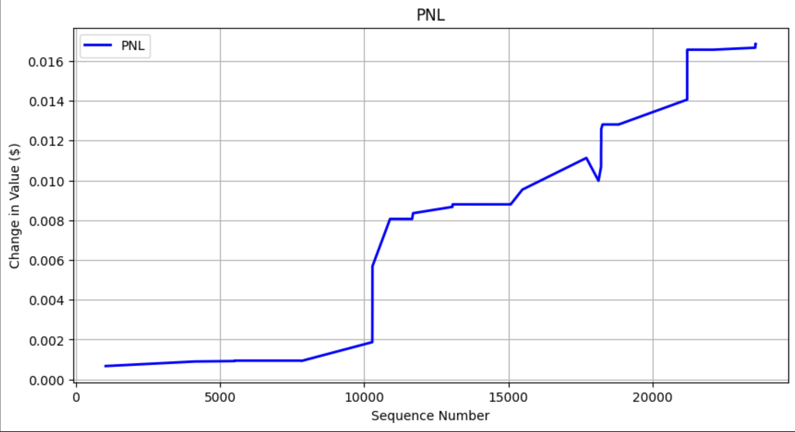
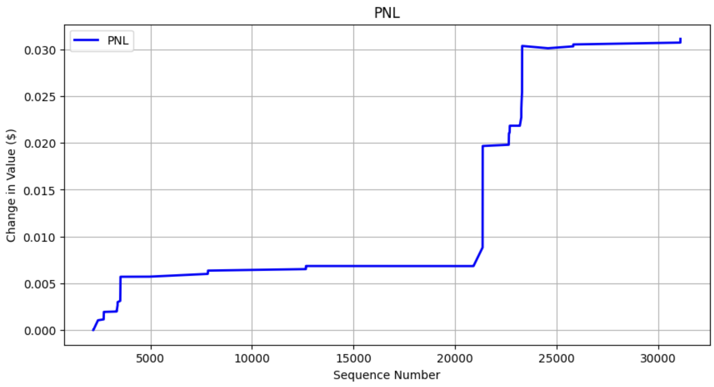

# Machine Learning Paper Trading ADVANCE Simulator
## About
This repo is a paper simulator to test the live performance of machine learning binary classifiers for choosing when to buy and sell stocks, cryptocurrencies, and other tradeable assets. This simulator is connected to the Coinbase exchange, but in theory, can be applied to any exchange and any asset class. You can plug and play any machine learning binary classifier to see its performance. The binary classifier should be trained to predict when the mid price will go up and when it will go down, and the simulator will show how accurately it will be able to do so. It will display the PnL of your model after the simulation runs.

## Workflow
### Connecting to Exchange
The simulation starts with reading in exchange data through websocket.py. Each exchange has different websocket APIs; currently, websocket.py is configured to read in data from Coinbase exchange. You have to provide your own API name and secret key to connect to each exchange. After the keys are plugged in, the websocket will continually read in updates and place each update into the `WebSocket.ws_updates_queue`, which is also accessible by `Simulator`.

### Updating Orderbook
After the `WebSocket` places each update on `WebSocket.ws_updates_queue`, the `Simulator` processes each update from `Simulator.websocket_updates_queue` in `Simulator.process_msg(msg)`, where `msg` is an orderbook update. In `Simulator.process_msg(msg)`, the function calls `OrderBook.process_updates(updates)`, which updates `OrderBook`. `OrderBook` contains real-time orderbook data from whichever exchange and asset `WebSocket` is connected to.

### Selling Positions
After the orderbook is updated, we check if any of our active positions have reached their sell time. All active positions are held in `Simulator.exposure`, which is made up of `Trade`. If 
`Trade.sell_sequence_number <= sequence_number`, then the current `Trade` is ready to sell. If a `Trade` is ready to sell, we pop it from `Simulator.exposure`, update `Simulator.pnl`, and place the `Trade` on `Simulator.completed_trades_queue`. This queue writes to a csv file of all the trades of the simulation.

### Machine Learning Price Movement Prediction and Buying Positions
After expired active positions are sold, we check if the current state of the orderbook might lead to an increase or decrease in mid price. We call `Simulator.binary_classifier.create_inference_vector(bids, asks, timestamp_str)`. This function returns a boolean, `1` means price will go up. If `1`, we place an active `Trade` position into `Simulator.exposure`. 

## Machine Learning & QR
All of the machine learning exists within `model.py` and `research.ipynb`. Feature engineering and model training is done in `research.ipynb`. Then, the model is imported into `model.py` and the feature engineering code for the inference vector is in `model.py`. Whenever a new model is plugged into `model.py`, we also have to change the code under `BinaryClassifier.create_inference_vector(bids, asks, timestamp_str)`, to reflect the appropriate inference vector for a new binary classifier.

## Personal Research and Development
The personal research and development I have done can be found in `research.py`. A key factor is the volume of asks and bids that are available within a certain $ `buy_amount`, or market depth. We see how much ask market depth we can buy for $`buy_amount`, and, after `time_lag` updates, we calculate the bid market depth for $`buy_amount`. If the bid market depth is less than the ask market depth for $`buy_amount`, this means the value of the asset increased and selling all of the volume of the asset will result in a profit. 

Feature vectors are engineered in `time_independent_features()` and `time_dependent_features()`. I focused on several factors related to market depth, volume, vwap, and price. 

Target feature is engineered in `create_time_lag()` and `create_gain_binary()`. `create_time_lag()` shifts the bid market depth column up by n rows. `create_gain_binary()` compares the "Ask Market Depth" value and the "Bid Market Depth Time Lag n" value. If 
"Ask Market Depth" value > "Bid Market Depth Time Lag n", 1 else 0. After the dataset in created, we train a model.

We do not include all columns in training. The feature vectors are found in `feature_columns` and the target vector is found in `target_gain`.
I am choosing to train an XGBoost model. After training, I look into the probability breakdown of `X_test`. I find that the best confidence limit is around 0.8 because most ground truth falses are captured under 0.56. In this environment, the most important factor to limit is false positives. Most false positives are under the probility of 0.56. While a 0.56 confirence limit also introduces high levels of false negatives, we have less concern for false negatives because a negative probability means we do not buy, so we do not exposure our position for loss. A false positive exposes us to loss. We want to limit false positives, maximize true positives, and 0.8 seems like a good limit.

Letting my model run, here is the PnL  
  
simulation_1_3_update_lag_xgbclassifier2.pkl
  
  
simulation_2_3_update_lag_xgbclassifier2.pkl  
 
