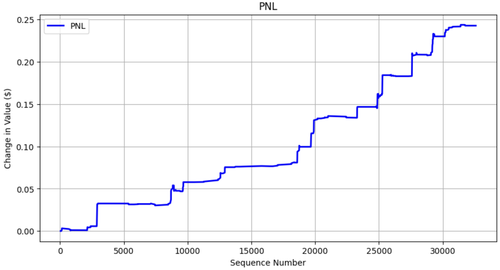

# Machine Learning Trader Advanced
## Table of Contents
- [Introduction](#introduction)
- [Features](#features)
- [Installation](#installation)
- [Usage](#usage)
- [Simulator Architecture](#simulator-architecture)
- [Research and Development](#personal-research-and-development)
- [Contributing](#contributing)

## Introduction
Welcome to the Machine Learning Trader Advanced repository! This project builds upon foundational concepts in algorithmic trading by integrating machine learning techniques to develop and evaluate trading strategies for various financial instruments, including stocks and cryptocurrencies. The simulator is designed to be adaptable, allowing for application across different exchanges and asset classes. If you have not read through Machine Learning Trader (Simple), please read that before continuing here.

## Features
Machine Learning Models: Can plug and play with different machine learning models to evaluate performance of different techniques.  
Real-Time Market Data Integration: Utilizes APIs to fetch live market data, enabling live paper trading.   
Performance Tracking: Records each simulated trade to assess the model's effectiveness.  

## Installation
To get started with the simulator, follow these steps:

Clone the Repository:

```bash
git clone https://github.com/sibster146/Machine_Learning_Trader_advance.git
cd Machine_Learning_Trader_advance
```

Set Up a Virtual Environment:
```bash
python -m venv env
source env/bin/activate  # On Windows: env\Scripts\activate
```

Install Dependencies:
```bash
pip install -r requirements.txt
```

Configure API Access:
Obtain your API credentials from the desired exchange or data provider.​
Set up your API credentials in the configuration file or as environment variables in `websocket.py`.

## Usage
Prepare Your Machine Learning Model:

Train your classifier using historical market data.​
Ensure the model outputs clear buy (1) and don't buy (0) signals.​

Integrate Your Model:  
Place your trained model file into the root directory.​  
Update the `model.py` script to load and utilize your model.​  

Run the Simulator:
```bash
python main.py
```
The simulator will fetch real-time data, generate predictions, execute simulated trades, and log the results.​

## Simulator Architecture
The simulator is structured as follows:  
main.py: The entry point that initializes and runs the simulation.​  
model.py: Handles loading and interfacing with the machine learning model.​  
simulator.py: Manages the simulation environment, including data fetching and trade execution.​  
orderbook.py: Simulates the order book and processes trade orders.​  
trade.py: Defines the trade execution logic.​  
websocket.py: Manages real-time data streaming from exchanges.​  

## Personal Research and Development
The personal research and development I have done can be found in `research.py`. A key factor is the volume of asks and bids that are available within a certain $ `buy_amount`, or market depth. We see how much ask market depth we can buy for $`buy_amount`, and, after `time_lag` updates, we calculate the bid market depth for $`buy_amount`. If the bid market depth is less than the ask market depth for $`buy_amount`, this means the value of the asset increased and selling all of the volume of the asset will result in a profit. 

Feature vectors are engineered in `time_independent_features()` and `time_dependent_features()`. I focused on several factors related to market depth, volume, vwap, and price. 

Target feature is engineered in `create_time_lag()` and `create_gain_binary()`. `create_time_lag()` shifts the bid market depth column up by n rows. `create_gain_binary()` compares the "Ask Market Depth" value and the "Bid Market Depth Time Lag n" value. If 
"Ask Market Depth" value > "Bid Market Depth Time Lag n", 1 else 0. After the dataset in created, we train a model

We do not include all columns in training. The feature vectors are found in `feature_columns` and the target vector is found in `target_gain`.
I am choosing to train an XGBoost model. After training, I look into the probability breakdown of `X_test`. I find that the best confidence limit is around 0.8 because most ground truth falses are captured under 0.8. In this environment, the most important factor to limit is false positives. Most false positives are under the probility of 0.8. While a 0.8 confirence limit also introduces high levels of false negatives, we have less concern for false negatives because a negative probability means we do not buy, so we do not exposure our position for loss. A false positive exposes us to loss. We want to limit false positives, maximize true positives, and 0.8 seems like a good limit.

Letting my model run, here is the PnL



Contributing
Contributions to enhance the simulator's functionality are welcomed. Please fork the repository and submit a pull request with your proposed changes.

